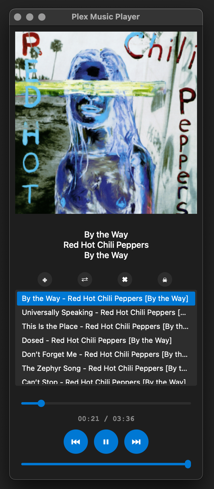

# Plex Music Player

A modern music player for Plex Media Server.



CAUTON! AI-generated

Should work on OSX, windows and linux.
Tested only on osx 15 with arm processor, windows 11, ubuntu 24.04

## Features

- 🎵 QT6 dark theme ui.
- 🎨 Album artwork display
- 📱 macOS Media Center integration
  - Now Playing information
  - Media controls (play/pause, next/previous track)
  - Album artwork in Media Center
- ⊞ Windows media keys integration
- 🎯 Automatic connection to Plex server at startup
- 🔄 Playlist management
  - Add/remove tracks
  - Shuffle playlist
  - Clear playlist
- 🎚️ Playback controls
  - Play/Pause
  - Next/Previous track
  - Progress bar with seeking
  - Volume control
- 📋 Track information display
  - Title
  - Artist
  - Album
  - Year
  - Duration
- 💾 Configuration persistence
  - Server connection details
  - Last played track
  - Playlist state

## Building from source

First, create and activate virtual environment (not needed for ARM64 build):
```bash
# Create virtual environment
python -m venv env

# Activate virtual environment
# On Windows:
.\env\Scripts\activate
# On macOS/Linux:
source env/bin/activate

# Install dependencies
pip install -r requirements.txt
```

### Windows
```powershell
# Ensure virtual environment is activated
.\env\Scripts\activate

# Run PowerShell script
.\build_windows.ps1
```
This will create `PlexMusicPlayer_windows_x86-64.exe` using PyInstaller.

### macOS
```bash
# Ensure virtual environment is activated
source env/bin/activate

# Run build script
./build_app_osx.sh
```
This will create a macOS app bundle in `dist/` directory using py2app.

### Linux (x86_64)
```bash
# Ensure virtual environment is activated
source env/bin/activate

# Run build script
./build_linux.sh
```
This will create `PlexMusicPlayer_linux_x86_64` binary using PyInstaller.

### Linux (ARM64)
For ARM64 builds, we use Docker with BuildKit. First, prepare the build environment:

```bash
# Enable QEMU for ARM64 emulation
docker run --rm --privileged multiarch/qemu-user-static --reset -p yes

# Create and configure buildx builder
docker buildx create --use --name multiarch-builder
docker buildx inspect --bootstrap
```

Then build the ARM64 binary:
```bash
# Build ARM64 binary
docker buildx build --platform linux/arm64 --output type=local,dest=./output .
```
The binary will be created in `output/PlexMusicPlayer_linux_arm64`.

You can optimize ARM64 build performance by setting QEMU parameters:
```bash
# Optional: Set QEMU parameters for better performance
export QEMU_CPU=max
export QEMU_SMP=8  # Adjust based on your CPU cores
```

### Build Requirements
- Windows: Python 3.12, PyQt6
- macOS: Python 3.11, PyQt6
- Linux x86_64: Python 3.12, PyQt6, build-essential
- Linux ARM64: Docker with BuildKit enabled

All platforms require the dependencies listed in `requirements.txt`.

## Media Center Integration

The player integrates with macOS Media Center and Windows Media Keys, providing:
- Track information in the Now Playing widget (macOS)
- Album artwork in the Media Center (macOS)
- Media controls from:
  - Media Center widget (macOS)
  - Touch Bar (macOS)
  - Media keys on keyboard (macOS and Windows)
  - Control Center (macOS)

## Known Issues

- **Timer Warning**: After pausing a track, you might see a "QObject::killTimer: Timers cannot be stopped from another thread" warning in the console. This is a known Qt issue and doesn't affect playback functionality.
- **Media Keys**: On Windows, media keys might take a few seconds to start working after application launch.

## License

feel free to use this project as you wish. 

