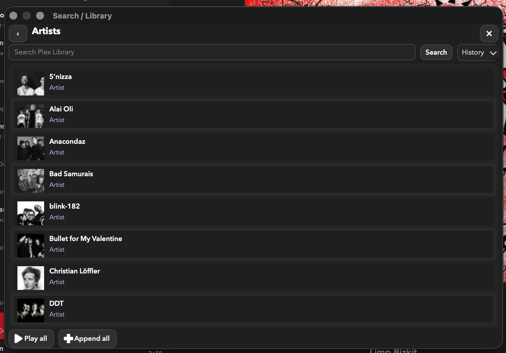
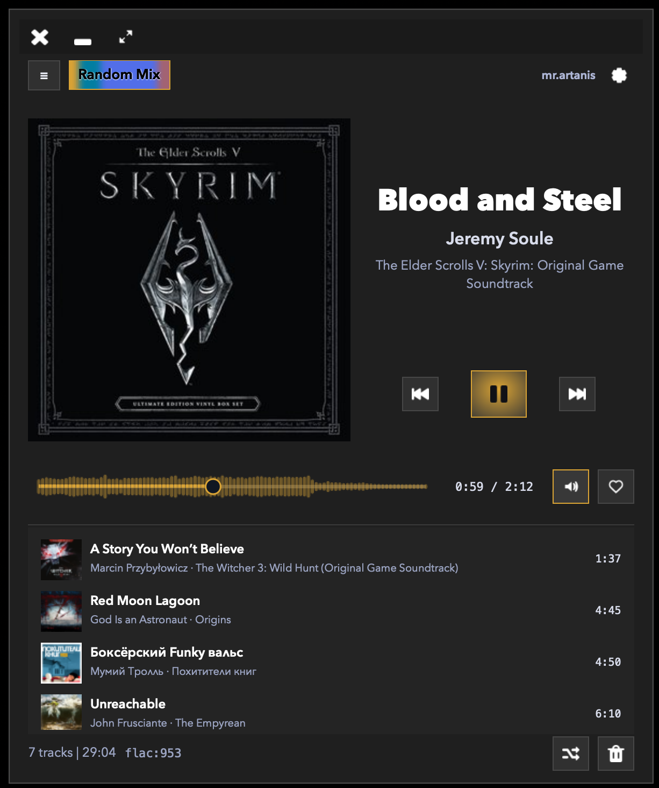
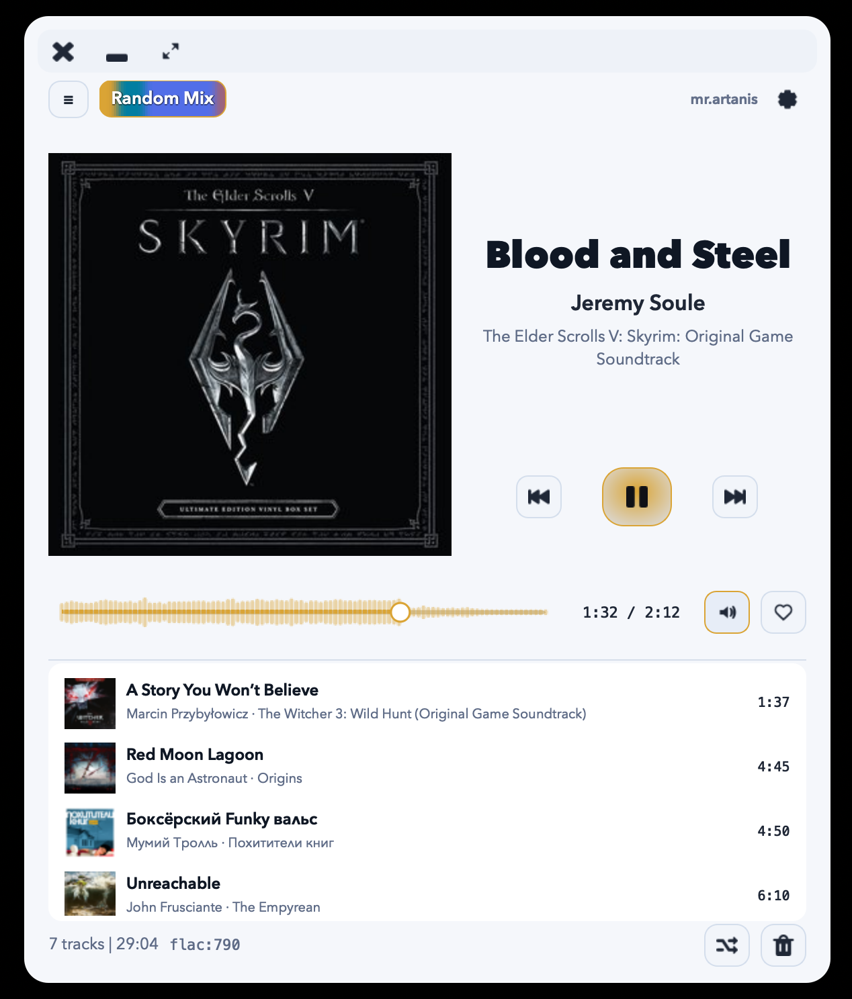
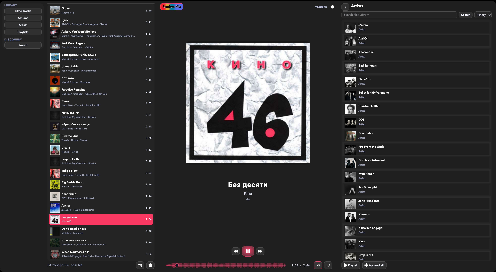
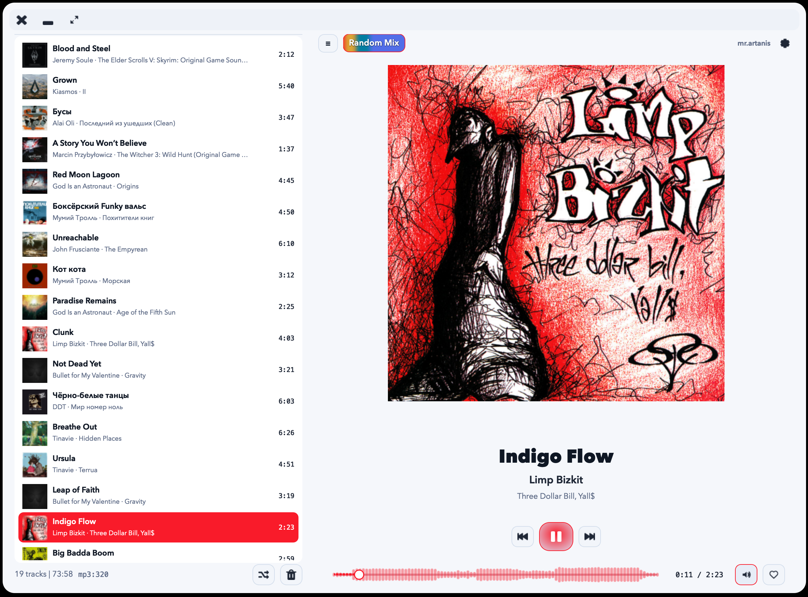

# Plex Music Player

Desktop Plex music player built as a Plex-focused fork of `YaYmp`.

## What It Does

- Plex PIN login with server and music library selection
- Search across tracks, artists, albums, and playlists
- `Liked Tracks` backed by Plex `userRating=10`
- `Artists`, `Albums`, and `Playlists` browsing with incremental loading
- `Random Mix` that starts fast and keeps a short random tail in the queue
- Persistent queue, artwork cache, waveform preview, shuffle/repeat, and system media controls
- macOS and Linux desktop builds via `Nuitka`

## Screenshots







## Plex-Specific Behavior

- `Random Mix` is a fast-start endless random queue
- `Like` writes Plex `userRating=10`
- `Liked Tracks` shows tracks with that maximum user rating
- Large library pages load incrementally instead of fetching everything upfront
- `Play all` for large sources streams tracks into the queue page by page

## Repository Layout

- `src/app` contains the active application
- `scripts` contains local run, test, lint, and build entrypoints
- `tests` contains contract, integration, smoke, and unit coverage
- `tools` contains packaging helpers and utility entrypoints
- `assets` contains app icons used by runtime and packaged builds
- `llm/PROJECT_RULES.md` contains durable implementation constraints for future work

## Development

Python `3.12+` is required.

Install dependencies:

```bash
python3 -m venv .venv
.venv/bin/python -m pip install -e '.[dev]'
```

Run locally:

```bash
./scripts/run_app.sh
```

Run checks:

```bash
./scripts/run_tests.sh
./scripts/run_lint.sh
```

## Packaging

Build Linux:

```bash
./scripts/build_nuitka_linux.sh
```

Build macOS:

```bash
./scripts/build_nuitka_macos.sh
```

Artifacts are built as `PlexMusicPlayer` / `Plex Music Player.app`, with the Plex player icon bundled from `assets/`.

## Current Notes

- The app uses `python-mpv` for playback and `plexapi` for library/auth access.
- Browser pages default to smaller incremental loads to keep the UI responsive on large libraries.
- Queue persistence is stored in SQLite tables, not a single serialized JSON blob.
